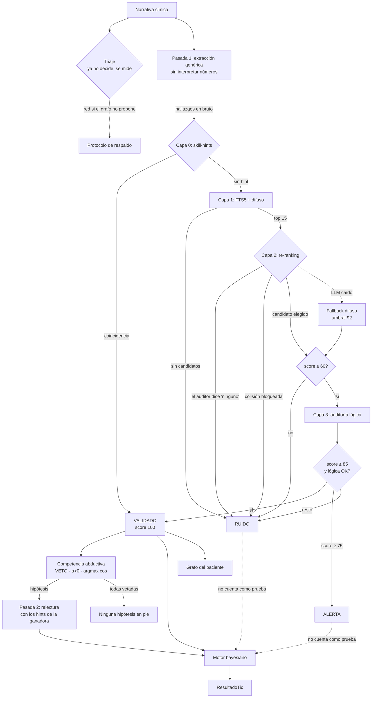

# Arquitectura

## Principio rector

Cada etapa degrada de forma segura. Si el triaje falla se usa el protocolo
general; si el modelo cae, la extracción devuelve vacío en lugar de
inventar; si el validador no puede confirmar un hallazgo, lo marca como
ruido en vez de dejarlo pasar.

**El sistema prefiere no decir nada antes que decir algo falso.**

## Flujo de un tic



## La competencia abductiva, que ahora decide

Hasta el ciclo 7 el protocolo activo lo elegía un prompt de triaje, en la
primera etapa, y todo lo demás colgaba de esa conjetura: la validación de
tres capas, el veto, los cocientes con su cita y el coseno. Era la pieza
menos medida del sistema y estaba en el sitio más temprano.

Peirce lo llamaría abducción: *se observa el hecho sorprendente C; si A
fuera verdadera, C sería de curso natural; luego hay razón para sospechar
A*. Un coseno alto es exactamente eso, así que **elegir la A que maximiza
`cos(h,e)` es la regla abductiva y no una analogía de ella** — y el grafo
del paciente puede proponer las candidatas sin preguntarle nada al modelo.

La competencia elige ahora la hipótesis, y el triaje sigue corriendo para
medirse contra ella: `triaje_coincide` se registra en cada tic y
`TicRepo.acuerdo_del_triaje()` lo agrega sobre el histórico. Dejar de
calcularlo sería quedarse sin la prueba justo cuando empieza a importar.

**Sobre la precondición.** El diseño decía «antes de sustituir el prompt por
esa regla hay que saber cuánto se equivoca», y esa cifra necesita histórico
que hoy no existe. Por eso la inversión tiene interruptor:
`HOLONMED_ABDUCCION_DECIDE=false` devuelve la decisión al triaje **sin
apagar la medición** — los dos siguen corriendo y el acuerdo se sigue
registrando. Un centro que prefiera medir antes de cambiar de mecanismo
puede hacerlo sin revertir código.

### Las dos pasadas

Φ necesita infones, los infones necesitan la skill, y la skill es lo que se
está eligiendo. El bloqueo se rompe leyendo dos veces:

```
pasada 1   extracción con el vocabulario genérico  -> conjunto COMÚN
competencia sobre ese conjunto                     -> la hipótesis
pasada 2   relectura con los hints de la ganadora  -> la deducción
```

La pasada 2 **es** el paso deductivo aplicado al texto que ya está en la
mano: antes de preguntarle nada al paciente, se relee la nota buscando lo
que la hipótesis predice y la lectura genérica no supo ver. Se fusiona por
término y gana la pasada 2, cuya normalización es mejor; lo que sólo vio la
genérica se conserva, porque la 2 lee con la hipótesis puesta y puede
desatender lo que no le concierne — y eso es justamente el resto no
simbolizado que Φ necesita para delatar una hipótesis ajena al paciente.

Si gana el propio protocolo genérico no hay segunda pasada: sería una
llamada al modelo para releer lo mismo.

### La pasada 1 no puede interpretar números

Es la restricción dura, y la razón es que lo que salga de ahí es el conjunto
contra el que compiten **todas** las candidatas: un corte inventado no
desvía una hipótesis, desvía la competencia entera.

La regla no es «hay un número». `general_triage` sí declara los cortes
universales —Temperatura 38.0, FC 100/60, leucocitos— y convertirlos es lo
que se le pide. Lo que no declara son los de cada enfermedad, y ahí el
modelo se los inventa: está medido en `VALIDACION.md` y el conversor
documenta el suyo, «lipasa 890» auditada como «>3x el límite normal (aprox.
250-300)» cuando el protocolo declara 60.

De modo que la pasada genérica puede volver concepto una cifra **sólo si el
término resultante es uno cuyo corte ella misma declara**. Se retira el
hallazgo cuando se cumplen las tres: la cita trae un número, el término no
aparece en esa misma cita, y el protocolo no lo autoriza. Se compara contra
la cita y no contra la narrativa entera, que es la evidencia que el propio
modelo alega — con el texto completo bastaría que la palabra saliera en otra
frase para colar una invención.

Retirar de más es barato: la pasada 1 sólo necesita conceptos con los que
buscar candidatas, y lo que se pierda lo recupera la pasada 2 con los cortes
del protocolo ganador delante. Retirar de menos no lo es. **Consecuencia
operativa:** el bloque `laboratorio:` del protocolo genérico decide qué
puede ver la pasada 1, así que recortarlo estrecha la competencia.

### Todas vetadas

Un veto ya no termina el tic: retira una candidata. El tic termina sólo si
el conjunto se vacía, y entonces no se cae al triaje. «Todas vetadas» no es
«no encontré hipótesis»: dice que *todo lo que el grafo propone para este
paciente es estructuralmente imposible*, y eso o pide ampliar el ámbito de
los protocolos o dice que los antecedentes que las excluyen están mal
registrados. Caer al triaje lo taparía con el comportamiento de siempre, y
el clínico no vería nunca que el índice se le queda corto.

```
1. VETO       cada candidata por separado. Un coseno bonito sobre una
              imposibilidad es ruido con formato numérico.
2. ADMISIÓN   α > 0. Sin ninguna procedencia no compite.
3. ORDEN      por coseno descendente, no por Φ.
4. AVISO      si la de mayor coseno quedó fuera por α, se dice.
```

**El paso 3 es la decisión con contenido.** Φ = α · cos, y α mide la calidad
documental del protocolo: una propiedad del índice, no del paciente.
Ordenar por Φ escogería la hipótesis mejor documentada en vez de la mejor
acoplada. α no desaparece — actúa como compuerta en el paso 2, no como peso
en el orden.

**El paso 4 es la otra mitad.** «La hipótesis que mejor encaja es X, coseno
1.00, y no compite porque su protocolo no cita sus cocientes» es una frase
verdadera y accionable: manda a arreglar el índice. Callada, la compuerta
hace que el sistema trate otra cosa sin decir por qué.

**Corre antes de la clasificación**, y no por orden de escritura. La etapa
de clasificación acuña un infón específico de la hipótesis activa y lo mete
en la lista; compitiendo después, ese término entraría en la evidencia de
todas las demás. Φ solo no lo delataría —el residuo salta los infones
derivados— pero el veto no tiene esa guarda, y es por donde el error entra.
Está fijado en
`test_la_competencia_corre_sobre_el_paciente_de_antes_de_clasificar`.

Las candidatas perdedoras se guardan a propósito: «se consideró
diverticulitis y sacó 0.25» *es* la traza de auditoría. Sin ella el sistema
mostraría una conclusión sin decir contra qué compitió.

## Por qué tres estados y no dos

Un booleano válido/inválido obliga a elegir entre dos errores malos: dejar
pasar hallazgos dudosos, o descartar hallazgos correctos en silencio.

El estado intermedio **ALERTA** cubre el caso real más frecuente: el
concepto existe con buena puntuación, pero la auditoría no encontró en el
texto la evidencia numérica que lo sostenga. Suele ocurrir cuando el clínico
escribe una impresión sin el dato de apoyo. Eso no es una alucinación, pero
tampoco es un hecho verificado.

Un hallazgo en alerta **se muestra y no cuenta**: aparece en pantalla para
que un humano decida, pero no entra en la línea de tiempo del holón ni
actualiza ninguna probabilidad.

Y un hallazgo descartado conserva **lo que escribió el clínico**, no lo que
el motor estuvo a punto de elegir. Mostrar «otro concepto» donde el médico
puso «coluria» haría el descarte incomprensible; el casi-match queda en la
traza, que es donde sirve para auditar.

## Recuperación en dos fases

La versión anterior cargaba el vocabulario entero en diccionarios de Python
y ejecutaba `rapidfuzz` sobre **todos** los términos en cada consulta. Con
la extensión española de SNOMED eso son más de un millón de comparaciones
por hallazgo, y cientos de MB residentes.

Ahora son dos fases:

1. **FTS5** reduce el millón de términos a unas decenas de candidatos, con
   índice invertido y ranking BM25. Dentro de SQLite, sin cargar nada.
2. **rapidfuzz** puntúa sólo esos candidatos. Sigue aportando tolerancia a
   erratas, pero sobre 40 cadenas en vez de un millón.

El coste pasa de lineal en el tamaño del vocabulario a prácticamente
constante, y la memoria del proceso deja de depender de él.

La consulta FTS se construye escapando cada palabra entre comillas y
uniéndolas con `OR`. Es necesario porque FTS5 tiene sintaxis propia
(`NEAR`, `-`, `*`, comillas) y el texto viene de la salida de un LLM: sin
escapar, un hallazgo con un guion sería un error de sintaxis.

## El grafo ontológico

Tres piezas con responsabilidades distintas:

| Tabla | Qué guarda | Por qué |
|-------|-----------|---------|
| `es_un` | Aristas directas padre/hijo | La verdad. Es un DAG: un concepto puede tener varios padres |
| `ancestro` | Cierre transitivo materializado | Optimización de consulta, sólo de lo que se usa |
| `mapeo` | Equivalencias entre sistemas | SNOMED → CIE-10, HPO → SNOMED |

### Por qué el cierre es parcial

Consultar los ancestros de un concepto suelto es barato con un CTE
recursivo: la profundidad típica son doce saltos y `es_un` está indexado.

Lo caro es la pregunta agregada: «qué pacientes tienen algo bajo esta rama».
Sin cierre hay que recorrer recursivamente por cada paciente.

Pero materializar el cierre completo de SNOMED serían decenas de millones de
filas para un vocabulario que un despliegue concreto apenas usa. La solución
es materializar **sólo los conceptos que aparecen en datos clínicos**,
construyendo el cierre al guardar un infón validado. Son unos miles de
filas, la consulta de cohorte pasa a ser un join indexado, y el cierre crece
con el uso real en vez de con el tamaño del vocabulario.

Se hace fuera de la transacción del tic a propósito: es una optimización de
lectura, no parte del dato clínico, y su fallo no debe invalidar un tic ya
guardado.

### La vista de grafo del paciente

`vecindad()` no devuelve el grafo entero, sino la porción que el paciente
ocupa: sus hallazgos validados más tres niveles de ancestros. El límite de
tres es deliberado — subir hasta la raíz conectaría todo con todo y no
explicaría nada, mientras que tres niveles hacen aparecer las agrupaciones
con sentido clínico.

## Los pesos de la confianza

```python
confianza = score_ontológico × 0.6 + score_lógico × 0.4
```

La ontología pesa más porque es determinista: o el concepto existe o no. La
auditoría lógica depende del juicio de un modelo de lenguaje, y por eso
pondera menos aunque su pregunta sea más interesante.

Los umbrales (85 para validar, 75 para alertar, 60 para molestarse en
auditar) son configurables, pero **son parámetros de seguridad clínica**:
bajarlos aumenta directamente la tasa de falsos positivos que entran en la
historia.

## Persistencia

SQLite embebido. La decisión inmediata fue de licencia — ArangoDB pasó a
BUSL-1.1 en la 3.12 y su Community Edition prohíbe el uso comercial y
limita el tamaño del dataset — pero el resultado técnico encaja mejor con el
caso de uso:

- Cero instalación. `git clone` y funciona.
- Un único archivo, que el profesional puede cifrar y respaldar como
  cualquier otro documento.
- FTS5 da búsqueda BM25 en español sin montar un Elasticsearch aparte.
- Dominio público: no impone ninguna condición aguas abajo.

La conexión es por hilo (`threading.local`) porque FastAPI ejecuta las rutas
síncronas en un pool y un `sqlite3.Connection` no se comparte entre hilos.
Las escrituras van tras un lock: SQLite admite un escritor a la vez, y en
modo WAL las lecturas no se bloquean.

### Colecciones

| Tabla | Contenido |
|-------|-----------|
| `paciente` | Datos demográficos y antecedentes |
| `tic` | Cada ciclo completo, con su texto original y su **origen** |
| `infon` | **Todos** los infones, incluidos los descartados |
| `documento` | Recetas e informes, colgados del tic que los originó |
| `cita` | Agenda |

## Actores del entorno clínico

La información clínica no llega de un solo sitio. Cada tic declara de
dónde viene:

| Origen | Qué aporta |
|--------|-----------|
| `consulta` | Narrativa dictada por el clínico |
| `laboratorio` | Informes de laboratorio, normalmente por PDF |
| `farmacia` | Prescripciones emitidas |
| `enfermeria` | Constantes, evolución de planta |
| `imagen` | Informes radiológicos |

Los tres primeros existían ya en el sistema original como un campo `type`
en cada nota (`ClinicalHolon`, `LabResult`, `Prescription`) y se perdieron
en la fusión. Recuperarlo destapó que **las recetas no se guardaban en
ninguna parte**: se generaba el PDF y el fármaco prescrito desaparecía del
registro, rompiendo la conciliación de la medicación en la visita
siguiente.

El origen no es una etiqueta decorativa:

- Un informe de laboratorio y una nota dictada no son la misma clase de
  evidencia, y a posteriori tienen que poder distinguirse.
- La consulta de historial se filtra por origen sin recorrer todo.
- `actor` registra quién asertó el dato. Hoy es informativo porque no hay
  autenticación, pero existe desde ahora para que añadirla después no
  obligue a migrar registros clínicos ya escritos.

Los infones **heredan** el origen de su tic por join. Duplicarlo en cada
infón permitiría que ambos valores se contradijeran.

### Migraciones

`CREATE TABLE IF NOT EXISTS` no toca una tabla que ya existe, así que las
columnas nuevas se añaden explícitamente en `Database._migrar`, que corre
**antes** del script de esquema: éste crea índices sobre columnas nuevas y
sobre una tabla antigua fallaría entero.

No hay número de versión de esquema: son pocas columnas, comprobar
`PRAGMA table_info` es barato, y así no hay forma de que una base quede a
medio migrar.

Se guardan también los descartados: es lo que permite auditar después si el
validador está rechazando de más. La línea de tiempo consultable filtra por
`estado = 'VALIDADO'`.

## El cliente LLM

Una sola puerta hacia Ollama, async, con timeouts explícitos y temperatura
fijada por configuración (0 por defecto — en clínica no se sube).

El parseo es defensivo por necesidad: los modelos locales envuelven el JSON
en vallas markdown, lo preceden de charla o lo cierran mal. `extraer_json`
intenta parseo directo, extracción de valla y recorte entre llaves. Si nada
funciona devuelve `{}`, **nunca una suposición**.

`elegir_opcion` es el otro patrón importante: para clasificaciones de
conjunto cerrado (triaje, intención), valida la respuesta contra las
opciones válidas y cae a un valor por defecto seguro. Un clasificador nunca
debe abrir la puerta a valores fuera del conjunto.

## Seguridad de entrada

Tres superficies reciben datos derivados de la salida de un LLM:

- **Nombres de skill** (`SkillManager.cargar`): el triaje devuelve un nombre
  que se convierte en ruta. Se normaliza con `Path.name` y se verifica la
  contención en el directorio antes de leer.
- **Campos de paciente** (`PacienteRepo.actualizar`): el router
  conversacional extrae `campo` y `valor` del mensaje. Hay lista blanca.
- **Consultas FTS** (`_consulta_fts`): se escapa cada palabra para que la
  sintaxis de FTS5 no se interprete.

Los nombres de documento en `/api/documentos/{nombre}` se resuelven y se
comprueba la contención antes de servirlos.


## Facturación

La cadena es deliberada y no se puede saltar ningún eslabón:

```
nota médica (P) ──► ORDEN ──► ejecución por un actor ──► cargo
                      ↑                 ↑
                  autoriza       confirma que se hizo
```

Una orden no describe: **autoriza**. Es un acto de habla que crea una
obligación, y por eso es la fuente de verdad para facturar. La ejecución
confirma que alguien la cumplió. El cargo sólo existe donde coinciden.

Eso convierte la propiedad antifraude en algo **estructural**: `cargo`
referencia siempre una `orden`. Sin autorización no hay cargo, no porque
se lo pidamos amablemente a un modelo sino porque no existe la fila.

### Del plan a la orden: proponer no es autorizar

El primer eslabón es el que más trabajo cuesta en la vida real: pasar de lo
que el médico escribe en el plan a una orden estructurada. HolonMed lee el
plan y **propone**; el médico firma.

```
        plan (texto)
             │
             ▼
    OrdenPropuesta ──[el médico pulsa el botón]──► ORDEN
      (borrador,                                (autorizada,
       no existe                                 ya factura)
       en la base)
```

`POST /api/facturacion/ordenes/proponer` no escribe nada. Devuelve
borradores con la cita del plan de la que sale cada uno, y sólo
`/ordenes/autorizar` crea filas. Son dos llamadas y no una a propósito:
entre ambas está la firma, que es lo único que convierte un texto sugerido
por un modelo en algo que obliga a otros a actuar.

El borrador se muestra distinto de la orden —otra caja, borde discontinuo—
y es editable antes de firmar, porque un modelo local se equivoca de
maneras que un clínico corrige en un segundo:

* Lo que el plan no especifica se muestra **como hueco vacío**, nunca
  relleno a ojo. Un hueco visible se corrige; uno inventado se firma sin
  mirar y acaba administrándose.
* Si el modelo devuelve una categoría («Medicamento») donde debía ir el
  fármaco, la propuesta se marca en rojo y no se corrige sola: adivinar
  cuál era es exactamente lo que no debe hacer.
* Cambiar el término borra el código: un código que ya no corresponde al
  término factura otra cosa.

### El descuadre vale más como seguridad que como dinero

De los tres resultados de la conciliación, sólo uno es de facturación:

| Situación | Qué significa |
|-----------|---------------|
| Orden sin ejecución | El paciente no recibió lo prescrito |
| Ejecución sin orden | Administración no autorizada |
| Orden + ejecución | Facturable |

Los dos primeros son incidentes clínicos que hoy se detectan tarde o
nunca. El mismo mecanismo que cuadra la cuenta cuadra la medicación, y de
las dos cosas la segunda importa más.

Por eso el módulo se llama `conciliacion` y no `facturador`: factura como
efecto secundario de comprobar que lo ordenado se cumplió.

### Tarifarios: un vocabulario más

Un catálogo de precios se carga con su propio `sistema`, igual que SNOMED
o CIE-10, y el enlace entre concepto clínico y código facturable usa la
misma tabla `mapeo`. No hay mecanismo nuevo: cada hospital o aseguradora
carga el suyo y el resto del sistema no se entera.

```bash
python scripts/importar_tarifario.py --json tarifario_iess.json
python scripts/importar_tarifario.py --csv tarifas.csv --sistema privado
```

La clave de `tarifa` incluye la fecha de vigencia y nunca se sobrescribe
una entrada antigua: una cuenta de hace un año debe poder reconstruirse
con los precios de entonces, no con los de hoy.

Mismo principio de licencias que con la terminología: el código que lee
los catálogos es libre; los catálogos los aporta quien tenga derecho a
usarlos. El repositorio incluye uno de demostración con importes
inventados.

### Salvaguardas contra el sobrecódigo

Un sistema que propone códigos facturables leyendo la narrativa es, con
dos ajustes, una máquina de facturar de más. Las reglas son duras y están
en los tests:

1. **Sin orden no hay cargo.** Estructural.
2. **Todo cargo nace propuesto.** Facturar exige que una persona lo
   confirme; cobrarle a un paciente por algo que dedujo un modelo sin que
   nadie lo revisara sería indefendible.
3. **Sin código tarifario no se factura.** Un hueco de catálogo no
   justifica aproximar un precio.
4. **El modelo no ve importes durante la extracción.** Si no sabe qué
   paga más, no puede optimizar por ello.

Queda un riesgo que ninguna regla técnica evita: si documentar de cierta
forma factura más, el clínico puede acabar describiendo la factura en vez
del paciente. Por eso las sugerencias del sistema son reactivas —señalan
lo que falta— y nunca proponen añadir prestaciones.

### La cuenta como proyección

El problema de las seis horas de espera al alta no es de velocidad de
proceso: es que la cuenta se calcula en bloque al final. Aquí los cargos
se acumulan según se concilian y `cuenta()` sólo proyecta lo acumulado.
Al alta no hay nada que calcular, sólo que cerrar — y `cerrable` dice si
queda algo sin resolver.
