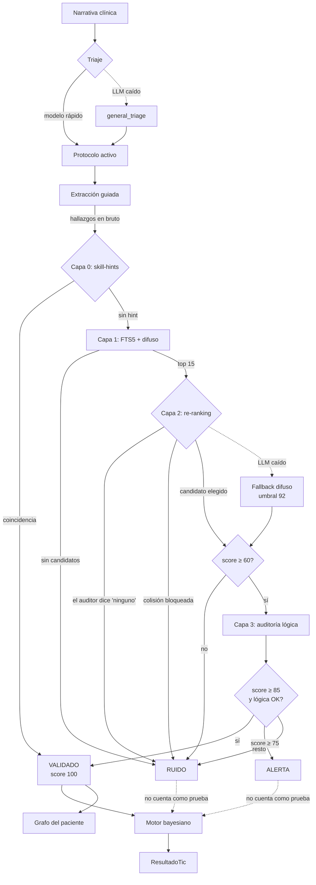

# Arquitectura

## Principio rector

Cada etapa degrada de forma segura. Si el triaje falla se usa el protocolo
general; si el modelo cae, la extracción devuelve vacío en lugar de
inventar; si el validador no puede confirmar un hallazgo, lo marca como
ruido en vez de dejarlo pasar.

**El sistema prefiere no decir nada antes que decir algo falso.**

## Flujo de un tic



## Por qué tres estados y no dos

Un booleano válido/inválido obliga a elegir entre dos errores malos: dejar
pasar hallazgos dudosos, o descartar hallazgos correctos en silencio.

El estado intermedio **ALERTA** cubre el caso real más frecuente: el
concepto existe con buena puntuación, pero la auditoría no encontró en el
texto la evidencia numérica que lo sostenga. Suele ocurrir cuando el clínico
escribe una impresión sin el dato de apoyo. Eso no es una alucinación, pero
tampoco es un hecho verificado.

Un hallazgo en alerta **se muestra y no cuenta**: aparece en pantalla para
que un humano decida, pero no entra en la línea de tiempo del holón ni
actualiza ninguna probabilidad.

Y un hallazgo descartado conserva **lo que escribió el clínico**, no lo que
el motor estuvo a punto de elegir. Mostrar «otro concepto» donde el médico
puso «coluria» haría el descarte incomprensible; el casi-match queda en la
traza, que es donde sirve para auditar.

## Recuperación en dos fases

La versión anterior cargaba el vocabulario entero en diccionarios de Python
y ejecutaba `rapidfuzz` sobre **todos** los términos en cada consulta. Con
la extensión española de SNOMED eso son más de un millón de comparaciones
por hallazgo, y cientos de MB residentes.

Ahora son dos fases:

1. **FTS5** reduce el millón de términos a unas decenas de candidatos, con
   índice invertido y ranking BM25. Dentro de SQLite, sin cargar nada.
2. **rapidfuzz** puntúa sólo esos candidatos. Sigue aportando tolerancia a
   erratas, pero sobre 40 cadenas en vez de un millón.

El coste pasa de lineal en el tamaño del vocabulario a prácticamente
constante, y la memoria del proceso deja de depender de él.

La consulta FTS se construye escapando cada palabra entre comillas y
uniéndolas con `OR`. Es necesario porque FTS5 tiene sintaxis propia
(`NEAR`, `-`, `*`, comillas) y el texto viene de la salida de un LLM: sin
escapar, un hallazgo con un guion sería un error de sintaxis.

## El grafo ontológico

Tres piezas con responsabilidades distintas:

| Tabla | Qué guarda | Por qué |
|-------|-----------|---------|
| `es_un` | Aristas directas padre/hijo | La verdad. Es un DAG: un concepto puede tener varios padres |
| `ancestro` | Cierre transitivo materializado | Optimización de consulta, sólo de lo que se usa |
| `mapeo` | Equivalencias entre sistemas | SNOMED → CIE-10, HPO → SNOMED |

### Por qué el cierre es parcial

Consultar los ancestros de un concepto suelto es barato con un CTE
recursivo: la profundidad típica son doce saltos y `es_un` está indexado.

Lo caro es la pregunta agregada: «qué pacientes tienen algo bajo esta rama».
Sin cierre hay que recorrer recursivamente por cada paciente.

Pero materializar el cierre completo de SNOMED serían decenas de millones de
filas para un vocabulario que un despliegue concreto apenas usa. La solución
es materializar **sólo los conceptos que aparecen en datos clínicos**,
construyendo el cierre al guardar un infón validado. Son unos miles de
filas, la consulta de cohorte pasa a ser un join indexado, y el cierre crece
con el uso real en vez de con el tamaño del vocabulario.

Se hace fuera de la transacción del tic a propósito: es una optimización de
lectura, no parte del dato clínico, y su fallo no debe invalidar un tic ya
guardado.

### La vista de grafo del paciente

`vecindad()` no devuelve el grafo entero, sino la porción que el paciente
ocupa: sus hallazgos validados más tres niveles de ancestros. El límite de
tres es deliberado — subir hasta la raíz conectaría todo con todo y no
explicaría nada, mientras que tres niveles hacen aparecer las agrupaciones
con sentido clínico.

## Los pesos de la confianza

```python
confianza = score_ontológico × 0.6 + score_lógico × 0.4
```

La ontología pesa más porque es determinista: o el concepto existe o no. La
auditoría lógica depende del juicio de un modelo de lenguaje, y por eso
pondera menos aunque su pregunta sea más interesante.

Los umbrales (85 para validar, 75 para alertar, 60 para molestarse en
auditar) son configurables, pero **son parámetros de seguridad clínica**:
bajarlos aumenta directamente la tasa de falsos positivos que entran en la
historia.

## Persistencia

SQLite embebido. La decisión inmediata fue de licencia — ArangoDB pasó a
BUSL-1.1 en la 3.12 y su Community Edition prohíbe el uso comercial y
limita el tamaño del dataset — pero el resultado técnico encaja mejor con el
caso de uso:

- Cero instalación. `git clone` y funciona.
- Un único archivo, que el profesional puede cifrar y respaldar como
  cualquier otro documento.
- FTS5 da búsqueda BM25 en español sin montar un Elasticsearch aparte.
- Dominio público: no impone ninguna condición aguas abajo.

La conexión es por hilo (`threading.local`) porque FastAPI ejecuta las rutas
síncronas en un pool y un `sqlite3.Connection` no se comparte entre hilos.
Las escrituras van tras un lock: SQLite admite un escritor a la vez, y en
modo WAL las lecturas no se bloquean.

### Colecciones

| Tabla | Contenido |
|-------|-----------|
| `paciente` | Datos demográficos y antecedentes |
| `tic` | Cada ciclo completo, con su texto original y su **origen** |
| `infon` | **Todos** los infones, incluidos los descartados |
| `documento` | Recetas e informes, colgados del tic que los originó |
| `cita` | Agenda |

## Actores del entorno clínico

La información clínica no llega de un solo sitio. Cada tic declara de
dónde viene:

| Origen | Qué aporta |
|--------|-----------|
| `consulta` | Narrativa dictada por el clínico |
| `laboratorio` | Informes de laboratorio, normalmente por PDF |
| `farmacia` | Prescripciones emitidas |
| `enfermeria` | Constantes, evolución de planta |
| `imagen` | Informes radiológicos |

Los tres primeros existían ya en el sistema original como un campo `type`
en cada nota (`ClinicalHolon`, `LabResult`, `Prescription`) y se perdieron
en la fusión. Recuperarlo destapó que **las recetas no se guardaban en
ninguna parte**: se generaba el PDF y el fármaco prescrito desaparecía del
registro, rompiendo la conciliación de la medicación en la visita
siguiente.

El origen no es una etiqueta decorativa:

- Un informe de laboratorio y una nota dictada no son la misma clase de
  evidencia, y a posteriori tienen que poder distinguirse.
- La consulta de historial se filtra por origen sin recorrer todo.
- `actor` registra quién asertó el dato. Hoy es informativo porque no hay
  autenticación, pero existe desde ahora para que añadirla después no
  obligue a migrar registros clínicos ya escritos.

Los infones **heredan** el origen de su tic por join. Duplicarlo en cada
infón permitiría que ambos valores se contradijeran.

### Migraciones

`CREATE TABLE IF NOT EXISTS` no toca una tabla que ya existe, así que las
columnas nuevas se añaden explícitamente en `Database._migrar`, que corre
**antes** del script de esquema: éste crea índices sobre columnas nuevas y
sobre una tabla antigua fallaría entero.

No hay número de versión de esquema: son pocas columnas, comprobar
`PRAGMA table_info` es barato, y así no hay forma de que una base quede a
medio migrar.

Se guardan también los descartados: es lo que permite auditar después si el
validador está rechazando de más. La línea de tiempo consultable filtra por
`estado = 'VALIDADO'`.

## El cliente LLM

Una sola puerta hacia Ollama, async, con timeouts explícitos y temperatura
fijada por configuración (0 por defecto — en clínica no se sube).

El parseo es defensivo por necesidad: los modelos locales envuelven el JSON
en vallas markdown, lo preceden de charla o lo cierran mal. `extraer_json`
intenta parseo directo, extracción de valla y recorte entre llaves. Si nada
funciona devuelve `{}`, **nunca una suposición**.

`elegir_opcion` es el otro patrón importante: para clasificaciones de
conjunto cerrado (triaje, intención), valida la respuesta contra las
opciones válidas y cae a un valor por defecto seguro. Un clasificador nunca
debe abrir la puerta a valores fuera del conjunto.

## Seguridad de entrada

Tres superficies reciben datos derivados de la salida de un LLM:

- **Nombres de skill** (`SkillManager.cargar`): el triaje devuelve un nombre
  que se convierte en ruta. Se normaliza con `Path.name` y se verifica la
  contención en el directorio antes de leer.
- **Campos de paciente** (`PacienteRepo.actualizar`): el router
  conversacional extrae `campo` y `valor` del mensaje. Hay lista blanca.
- **Consultas FTS** (`_consulta_fts`): se escapa cada palabra para que la
  sintaxis de FTS5 no se interprete.

Los nombres de documento en `/api/documentos/{nombre}` se resuelven y se
comprueba la contención antes de servirlos.
