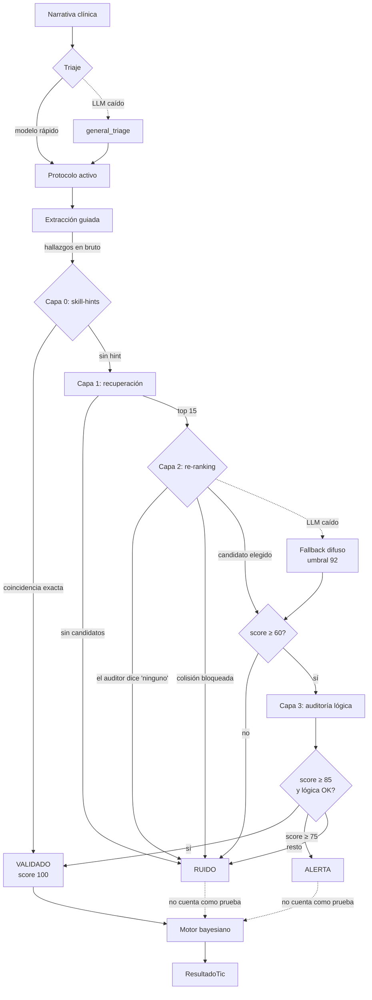

# Arquitectura

## Principio rector

Cada etapa degrada de forma segura. Si el triaje falla se usa el protocolo
general; si el modelo cae, la extracción devuelve vacío en lugar de
inventar; si el validador no puede confirmar un hallazgo, lo marca como
ruido en vez de dejarlo pasar.

**El sistema prefiere no decir nada antes que decir algo falso.**

## Flujo de un tic



## Por qué tres estados y no dos

Un booleano válido/inválido obliga a elegir entre dos errores malos: dejar
pasar hallazgos dudosos, o descartar hallazgos correctos en silencio.

El estado intermedio **ALERTA** cubre el caso real más frecuente: el
concepto existe en SNOMED con buena puntuación, pero la auditoría no
encontró en el texto la evidencia numérica que lo sostenga. Suele ocurrir
cuando el clínico escribe una impresión sin el dato de apoyo. Eso no es una
alucinación, pero tampoco es un hecho verificado.

Un hallazgo en alerta **se muestra y no cuenta**: aparece en pantalla para
que un humano decida, pero no entra en la línea de tiempo del holón ni
actualiza ninguna probabilidad.

## Los pesos de la confianza

```python
confianza = score_ontológico × 0.6 + score_lógico × 0.4
```

La ontología pesa más porque es determinista: o el concepto existe en
SNOMED o no existe. La auditoría lógica depende del juicio de un modelo de
lenguaje, y por eso pondera menos aunque su pregunta sea más interesante.

Los umbrales (85 para validar, 75 para alertar, 60 para molestarse en
auditar) son configurables en `.env`, pero **son parámetros de seguridad
clínica**: bajarlos aumenta directamente la tasa de falsos positivos que
entran en la historia.

## Backends de SNOMED

Dos implementaciones intercambiables tras el mismo protocolo:

| | `LocalSnomedIndex` | `ArangoSnomedIndex` |
|---|---|---|
| Motor | rapidfuzz sobre diccionario en memoria | ArangoSearch BM25, analizador `text_es` |
| Arranque | instantáneo con cache pickle | instantáneo |
| Memoria | cientos de MB en el proceso | fuera del proceso |
| Escala | una instancia | varias instancias comparten índice |

La normalización de scores es la parte delicada: rapidfuzz da 0-100
directamente, mientras que BM25 no está acotado. El backend de Arango
normaliza contra el mejor resultado de cada consulta para que los umbrales
del pipeline signifiquen lo mismo con ambos motores.

`HOLONMED_SNOMED_BACKEND=auto` elige local si encuentra los datos, y Arango
si no.

## Persistencia opcional

ArangoDB se eligió por dos razones del dominio: la historia clínica es un
grafo, y ArangoSearch da búsqueda BM25 en español sin montar un
Elasticsearch aparte.

Pero el sistema **arranca sin base de datos**. Los repositorios devuelven
vacío, `/health` lo reporta y el validador funciona igual. Un fallo de
persistencia no debe impedir que alguien use el motor.

Por eso hay un sondeo TCP de un segundo antes de invocar al driver: sin él,
`python-arango` reintenta con backoff exponencial y el arranque tarda casi
un minuto en una máquina sin ArangoDB — un impuesto absurdo sobre el caso
que sí queremos soportar.

## Colecciones

| Colección | Contenido |
|-----------|-----------|
| `Pacientes` | Datos demográficos y antecedentes |
| `Tics` | Cada ciclo completo, con su texto original y todos sus infones |
| `Infones` | Sólo los validados, indexados para la línea de tiempo |
| `Citas` | Agenda |
| `Documentos` | Metadatos de los PDF generados |

Se guardan **todos** los infones en `Tics`, incluidos los descartados: es
lo que permite auditar el comportamiento del validador a posteriori. En
`Infones` sólo entran los validados, que son los consultables como
historia.

## El cliente LLM

Una sola puerta hacia Ollama, async, con timeouts explícitos y temperatura
fijada por configuración (0 por defecto — en clínica no se sube).

El parseo es defensivo por necesidad: los modelos locales envuelven el JSON
en vallas markdown, lo preceden de charla o lo cierran mal. `extraer_json`
intenta parseo directo, extracción de valla y recorte entre llaves. Si
nada funciona devuelve `{}`, **nunca una suposición**.

`elegir_opcion` es el otro patrón importante: para clasificaciones de
conjunto cerrado (triaje, intención), valida la respuesta contra las
opciones válidas y cae a un valor por defecto seguro. Un clasificador nunca
debe abrir la puerta a valores fuera del conjunto.

## Seguridad de entrada

Dos superficies merecen atención porque reciben datos derivados de la
salida de un LLM:

- **Nombres de skill** (`SkillManager.cargar`): el triaje devuelve un
  nombre que se convierte en ruta de archivo. Se normaliza con `Path.name`
  y se verifica la contención en el directorio antes de leer.
- **Campos de paciente** (`PacienteRepo.actualizar`): el router
  conversacional extrae `campo` y `valor` del mensaje del usuario. Hay
  lista blanca de campos actualizables.

Los nombres de documento en `/api/documentos/{nombre}` se resuelven y se
comprueba la contención antes de servirlos.
